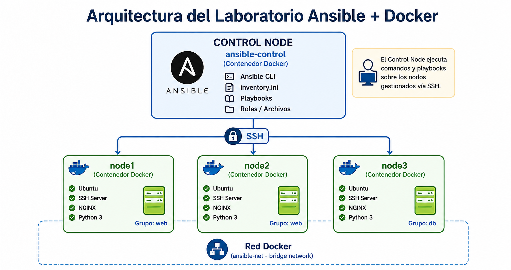
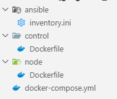
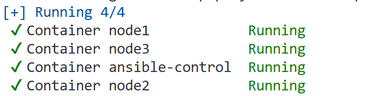
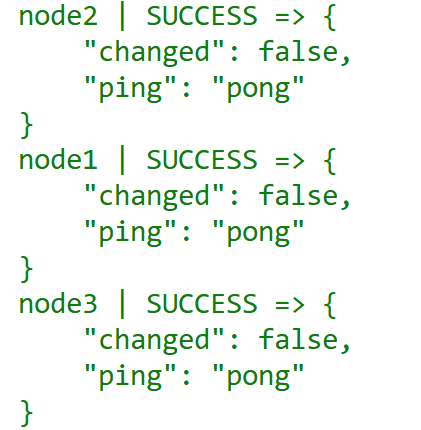
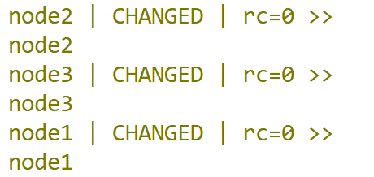
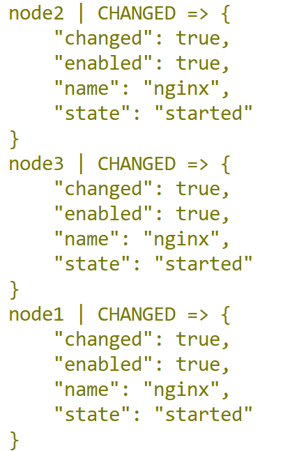
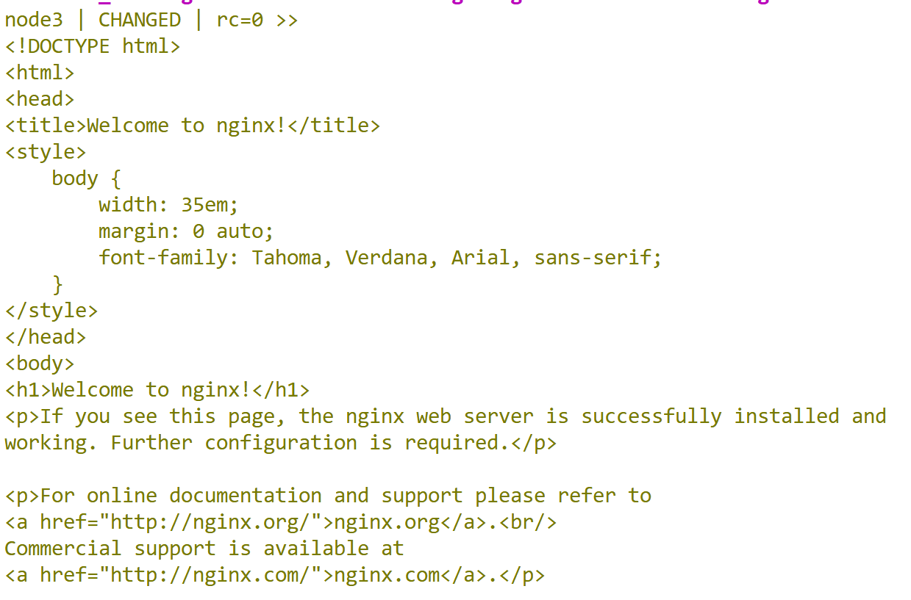
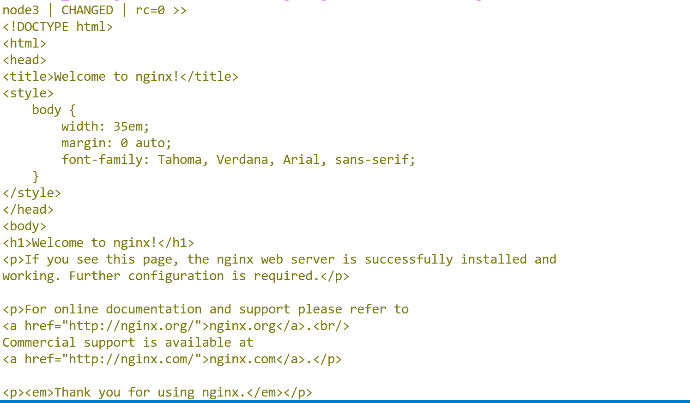

# 1. Preparación del entorno y primera automatización

Simularas una infraestructura real con múltiples servidores Linux  usando contenedores de Docker, usando ansible desplegaremos un servidor nginx con una página web de prueba en diferentes servidores


## Objetivos
- Configurar los contenedores para trabajar con ansible
- Crear el inventario con el registro de los nodos
- Automatizar instalación de servidor web 
- Desplegar una página web en los servidores. 

---
<!--Este fragmento es la barra de 
navegación-->

<div style="width: 400px;">
        <table width="50%">
            <tr>
                <td style="text-align: center;">
                    <a href=""></a>
                    <br>anterior
                </td>
                <td style="text-align: center;">
                   <a href="../README.md">Lista Laboratorios</a>
                </td>
<td style="text-align: center;">
                    <a href="../Capitulo2/"></a>
                    <br>siguiente
                </td>
            </tr>
        </table>
</div>

---

## Diagrama 

Se espera que el alumno analice la siguiente estructura de aplicación. 




## Instrucciones 
1. Crear un directorio en el escritorio llamado automatización. 

2. Dentro de automatización crear la siguiente estructura de archivos. 



3. Dentro de la carpeta **ansible/inventory.ini** en el archivo **.ini** añadir el siguiente contenido: 


```ini
[web]
node1
node2

[db]
node3

[all:vars]
ansible_user=ansible
ansible_password=ansible
ansible_connection=ssh
ansible_python_interpreter=/usr/bin/python3
ansible_ssh_common_args='-o StrictHostKeyChecking=no'
```

4. En la carpeta **control/Dockerfile** en el archivo **Dockerfile** añadir el siguiente contenido: 

> Nota: Configuración del nodo principal 


```Dockerfile
FROM ubuntu:22.04

RUN apt update && apt install -y \
    ansible \
    openssh-client \
    sshpass \
    vim \
    curl \
    iputils-ping \
    && apt clean

WORKDIR /ansible

CMD ["/bin/bash"]
```

5. En el archivo **node/Dockerfile** añadir la configuración del nodo: 


```Dockerfile
FROM ubuntu:22.04

RUN apt update && apt install -y \
    openssh-server \
    python3 \
    sudo \
    vim \
    curl \
    && apt clean

RUN useradd -m -s /bin/bash ansible \
    && echo "ansible:ansible" | chpasswd \
    && echo "ansible ALL=(ALL) NOPASSWD:ALL" >> /etc/sudoers

RUN mkdir /var/run/sshd

EXPOSE 22

CMD ["/usr/sbin/sshd", "-D"]
```


6. En el archivo **docker-compose.yml** añadir la siguiente configuración:

```yml
services:
  ansible-control:
    build: ./control
    container_name: ansible-control
    hostname: ansible-control
    networks:
      - ansible-net
    volumes:
      - ./ansible:/ansible
    tty: true
    stdin_open: true

  node1:
    build: ./node
    container_name: node1
    hostname: node1
    networks:
      - ansible-net
    tty: true
    stdin_open: true

  node2:
    build: ./node
    container_name: node2
    hostname: node2
    networks:
      - ansible-net
    tty: true
    stdin_open: true

  node3:
    build: ./node
    container_name: node3
    hostname: node3
    networks:
      - ansible-net
    tty: true
    stdin_open: true

networks:
  ansible-net:
    driver: bridge
```

7. Para iniciar toda la infraestructura usaremos el comando:

```bash
docker-compose up -d
```

> Nota: Ese comando iniciará toda la infraestructura con 3 nodos y un ansible control 




8. Entrar al nodo de control

```bash
docker exec -it ansible-control bash
```

9. Estando en el nodo de control ejecutar el siguiente comando:

```bash
ansible all -i inventory.ini -m ping
```



10. Ejecutar comando ad-hoc

```bash
ansible all -i inventory.ini -m shell -a "hostname"
```



11. Automatizar instalación de **nginx** en todos los nodos:

```bash
ansible all -i inventory.ini -m apt -a "name=nginx state=present update_cache=yes" --become
```

12. Validar instalación

```bash
ansible all -i inventory.ini -m shell -a "nginx -v"
```


13. Iniciar el servicio

```bash
ansible all -i inventory.ini -m service -a "name=nginx state=started enabled=yes" --become
```


14. Validar página

```bash
ansible all -i inventory.ini -m shell -a "curl localhost"
```



## Resultado esperado

Al final deberíamos de ver algo similar: 

