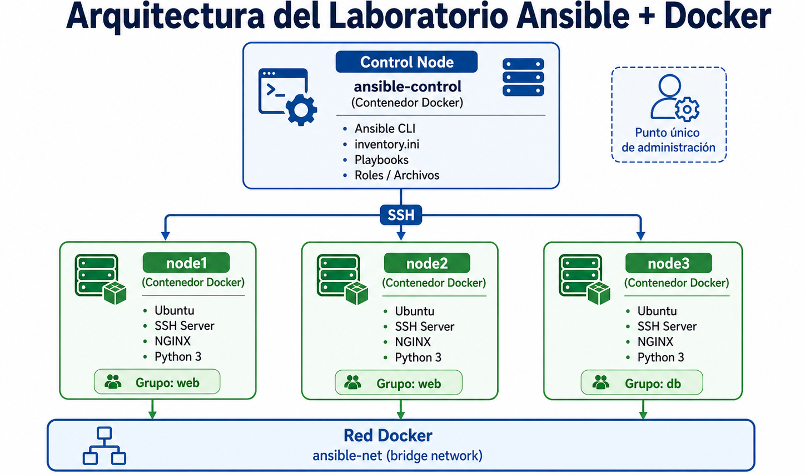
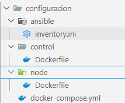
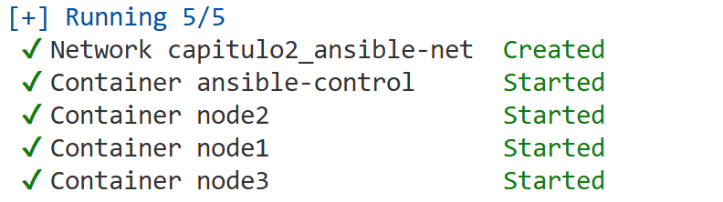
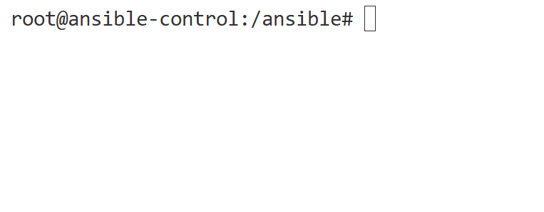
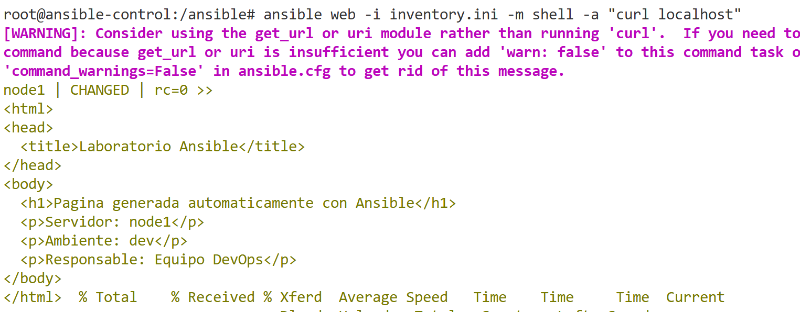
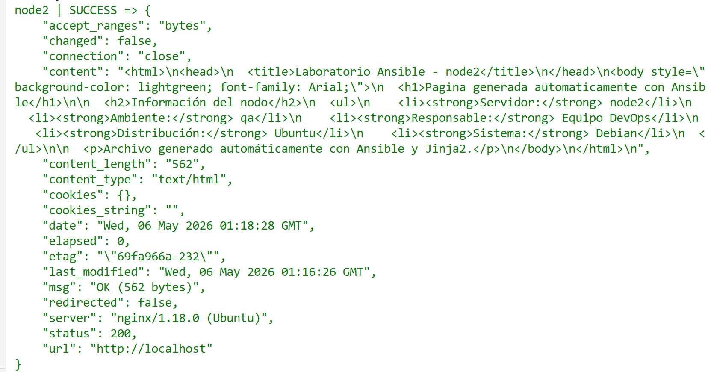

# 2. Playbooks y Roles Reutilizables
En este laboratorio se espera que el alumno pueda desplegar un playbook para la automatización de tareas en Ansible y el uso de roles y jinga2 para crear roles, templates reutilizables


## Objetivos
- Desplegar infraestructura con docker
- Crear un playbook para definir tareas automatizadas
- Crear templates reutilizables con Jinja2
- Definir roles para la reutilización de configuración


---
<!--Este fragmento es la barra de 
navegación-->

<div style="width: 400px;">
        <table width="50%">
            <tr>
                <td style="text-align: center;">
                    <a href="../Capitulo1/"></a>
                    <br>anterior
                </td>
                <td style="text-align: center;">
                   <a href="../README.md">Lista Laboratorios</a>
                </td>
<td style="text-align: center;">
                    <a href="../Capitulo3/"></a>
                    <br>siguiente
                </td>
            </tr>
        </table>
</div>

---

## Diagrama



<br>


## Instrucciones
> Para este laboratorio es necesario descargar el contenido de la carpeta **configuración** que se encuentra en este repositorio. 

1. Al descargar la carpeta de  **configuración** deberíamos de observar la siguiente estructura de archivos. 




2. Debemos de abrir una terminal dentro de esa carpeta y ejecutar el siguiente comando:

```bash
docker-compose up -d
```

3. Esperamos que comience la arquitectura



4. Nos conectamos al nodo de control:

```bash
docker exec -it ansible-control bash
```

5. Validamos que estemos en la ruta **/ansible**:



6. Instalar **nano** en el nodo principal

```bash
apt-get update
```

```bash
apt-get install nano
```

7. **Crear carpetas base**, crearemos las carpetas principales para cada uno de los componentes de ansible:

```bash
mkdir -p group_vars host_vars playbooks roles
```

8. **Configuramos las variables de grupo**: Estas variables las definiremos para crear variables que serán compartidas por múltiples nodos:

```bash
nano group_vars/web.yml
```

**web.yml**
```yaml
web_package: nginx
web_service: nginx
web_message: "Página generada automáticamente con Ansible"
web_owner: "Equipo DevOps"
```

9. **Crear las variables por host**: Ahora declararemos las variable que se declaran individualmente a cada host:
---
```bash
nano host_vars/node1.yml
```

**node1.yml**
```yml
ambiente: "dev"
web_color: "lightblue"
```
---

```bash
nano host_vars/node2.yml
```

**node2.yml**
```yml
ambiente: "qa"
web_color: "lightgreen"
```
---

10. **Definir playbook sin roles** Ahora crearemos un playbook completo sin reutilización. 

```bash
nano playbooks/webserver.yml
```

```yml
- name: Instalar y configurar NGINX en nodos web
  hosts: web
  become: true

  tasks:
    - name: Actualizar caché de paquetes
      apt:
        update_cache: true
      tags: install

    - name: Instalar servidor web
      apt:
        name: "{{ web_package }}"
        state: present
      tags: install

    - name: Iniciar NGINX
      shell: service nginx start
      tags: service

    - name: Crear página HTML personalizada
      copy:
        content: |
          <html>
          <head>
            <title>Laboratorio Ansible</title>
          </head>
          <body>
            <h1>{{ web_message }}</h1>
            <p>Servidor: {{ inventory_hostname }}</p>
            <p>Ambiente: {{ ambiente }}</p>
            <p>Responsable: {{ web_owner }}</p>
          </body>
          </html>
        dest: /var/www/html/index.html
        mode: '0644'
      notify: Reiniciar nginx
      tags: config

  handlers:
    - name: Reiniciar nginx
      shell: service nginx restart
```

11. Ejecutar el primer playbook 

```bash
ansible-playbook -i inventory.ini playbooks/webserver.yml
```

12. Probar las etiquetas para la ejecución controlada:

**ejecutar sólo instalación**
```bash
ansible-playbook -i inventory.ini playbooks/webserver.yml --tags install
```

**ejecutar sólo configuración**
```bash
ansible-playbook -i inventory.ini playbooks/webserver.yml --tags config
```

**Ejecutar solo servicio**
```bash
ansible-playbook -i inventory.ini playbooks/webserver.yml --tags service
```

13. Validar desde Ansible

```bash
ansible web -i inventory.ini -m shell -a "curl localhost"
```


14. **Crear role webserver**

```bash
ansible-galaxy init roles/webserver
```

15. Configurar **defaults del role**

```bash
nano roles/webserver/defaults/main.yml
```
**main.yml**
```yml
web_package: nginx
web_service: nginx
web_message: "Página creada desde un role de Ansible"
web_owner: "Equipo de Infraestructura"
ambiente: "default"
web_color: "white"
```

16. **Configurar template Jinja2**: Aquí crearemos el template necesario para reutilizar el código dependiendo del ambiente:

```bash
mkdir roles/webserver/templates
```

```bash
nano roles/webserver/templates/index.html.j2
```

**index.html.j2**
```html
<html>
<head>
  <title>Laboratorio Ansible - {{ inventory_hostname }}</title>
</head>
<body style="background-color: {{ web_color }}; font-family: Arial;">
  <h1>{{ web_message }}</h1>

  <h2>Información del nodo</h2>
  <ul>
    <li><strong>Servidor:</strong> {{ inventory_hostname }}</li>
    <li><strong>Ambiente:</strong> {{ ambiente }}</li>
    <li><strong>Responsable:</strong> {{ web_owner }}</li>
    <li><strong>Distribución:</strong> {{ ansible_distribution }}</li>
    <li><strong>Sistema:</strong> {{ ansible_os_family }}</li>
  </ul>

  <p>Archivo generado automáticamente con Ansible y Jinja2.</p>
</body>
</html>
```

17. **Configurar tasks del role**

```bash
nano roles/webserver/tasks/main.yml
```

**main.yml**
```yml
- name: Actualizar caché de paquetes
  apt:
    update_cache: true
  tags: install

- name: Instalar servidor web
  apt:
    name: "{{ web_package }}"
    state: present
  tags: install

- name: Crear página HTML desde template
  template:
    src: index.html.j2
    dest: /var/www/html/index.html
    mode: '0644'
  notify: Reiniciar nginx
  tags: config

- name: Iniciar servicio nginx
  shell: service {{ web_service }} start
  tags: service
```

18. **Configurar el handler del role**: En este archivo se describe lo que tendrá que hacer ansible cuando haya cambios en la configuración: 

```bash
nano roles/webserver/handlers/main.yml
```

```yml
- name: Reiniciar nginx
  shell: service {{ web_service }} restart
```

19. **Crear playbook final usando role**

```bash
nano playbooks/site.yml
```

**site.yml**
```yml
- name: Desplegar servidor web usando role reutilizable
  hosts: web
  become: true

  roles:
    - webserver
```

20. Ejecutar playbook con role

```bash
ANSIBLE_ROLES_PATH=/ansible/roles ansible-playbook -i inventory.ini playbooks/site.yml
```


21. Validar resultado final:

```bash
ansible web -i inventory.ini -m uri -a "url=http://localhost return_content=yes"
```


## Resultado esperado
Al final del laboratorio se observaría el siguiente resultado donde se conecta a cada nodo web y válida que la página funciona correctamente

