# 3. Playbook de hardening + Vault + validación

Realiza la automatización de seguridad para los nodos administrados del laboratorio. El objetivo es aplicar una configuración base de hardening, proteger datos sensibles mediante Ansible Vault y validar el estado final de los servidores.


## Objetivos
- Implementar hardening base para servidores linux
- Usar Ansible Vault para almacenar datos sensibles 
- Validar la configuración de seguridad

---

<div style="width: 400px;">
        <table width="50%">
            <tr>
                <td style="text-align: center;">
                    <a href="../Capitulo2/"></a>
                    <br>anterior
                </td>
                <td style="text-align: center;">
                   <a href="../README.md">Lista Laboratorios</a>
                </td>
<td style="text-align: center;">
                    <a href="../Capitulo4/"></a>
                    <br>siguiente
                </td>
            </tr>
        </table>
</div>

---


## Diagrama

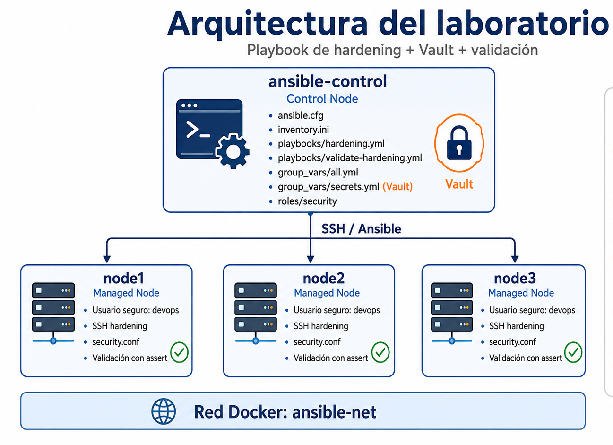

## Instrucciones
1. Descargar el archivo configuración que se encuentra en este laboratorio. 

2. En el archivo encontraremos la infraestructura para el laboratorio. 

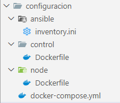

3. Levantar la infraestructura abriendo una terminal dentro de la carpeta configuración, usando el siguiente comando:

```bash
docker-compose up -d
```

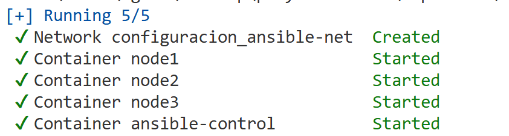

4. Nos conectamos al contenedor de control:

```bash
docker exec -it ansible-control bash
```

5. Instalamos nano:

```bash
apt-get update
```

```bash
apt-get install nano
```

6. Validamos que estemos en la ruta **/ansible**

7. Validamos que tengamos nuestro inventario **inventory.ini**

```bash
cat inventory.ini
```

8. Validamos que ansible pueda conectarse a los nodos:

```bash
ansible all -i inventory.ini -m ping
```

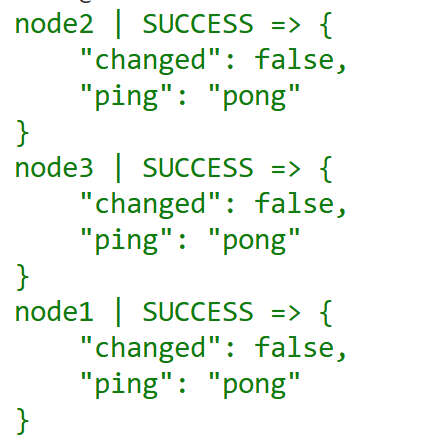

9. Crear estructura base del laboratorio:

```bash
mkdir -p playbooks
mkdir -p group_vars
mkdir -p roles
```

10. Creamos las variables generales 

```bash
nano group_vars/all.yml
```

**all.yml**
```yml 
secure_user: devops
secure_group: sudo
ssh_port: 22
allowed_users:
  - devops
  - ansible
security_directory: /opt/security
security_file: /opt/security/security.conf
```


11. Crear archivo para secretos 

```bash
ansible-vault create group_vars/secrets.yml
```

**Cuando solicite el password usa una temporal para el laboratorio**

```bash
vault123
```

**Dentro del archivo agregamos lo siguiente, son valores que deberían estar protegidos**
```yml
secure_password: "PasswordSeguro123"
admin_email: "admin@empresa.com"
api_token: "token-demo-12345"
```

> Nota: Para cerrar el archivo de secretos usamos la tecla **esc** seguido de **:wq**

12. Validamos que el archivo este cifrado:

```bash
cat group_vars/secrets.yml
```


13. Creamos el rol de seguridad: 

```bash
ansible-galaxy init roles/security
```

14. Validamos la estructura creada:

```bash
ls -R roles/security
```

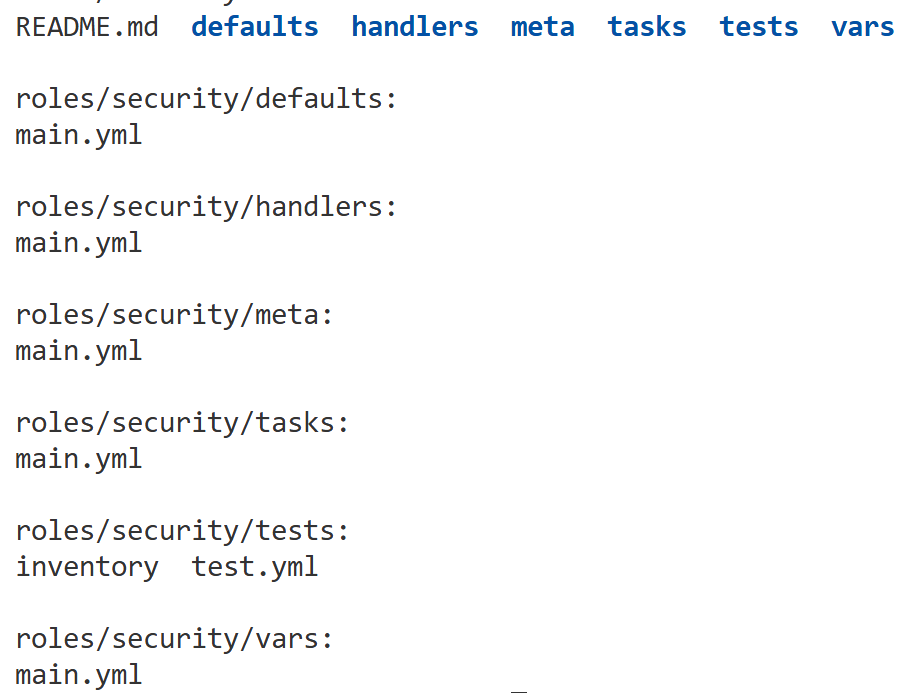


15. Configuramos variables por defecto del role:

```bash
nano roles/security/defaults/main.yml
```
**main.yml**
```yml
secure_user: devops
secure_group: sudo
ssh_port: 22
security_directory: /opt/security
security_file: /opt/security/security.conf
```

> Nota: Este archivo define valores por defecto que pueden ser sobrescritos desde **group_vars**.


16. Crear template de configuración segura: 

```bash
mkdir roles/security/templates
```

```bash
nano roles/security/templates/security.conf.j2
```

**security.conf.js**
```conf
usuario_seguro={{ secure_user }}
grupo_seguro={{ secure_group }}
correo_admin={{ admin_email }}
ssh_port={{ ssh_port }}
hostname={{ inventory_hostname }}
sistema={{ ansible_distribution }}
familia_os={{ ansible_os_family }}

# Este archivo contiene informaci  n protegida y debe tener permisos restringidos.
```

17. Configurar las tareas del role

```bash
nano roles/security/tasks/main.yml
```

**main.yml**
```yml
- name: Crear grupo seguro
  group:
    name: "{{ secure_group }}"
    state: present
  tags:
    - users
    - hardening

- name: Crear usuario seguro
  user:
    name: "{{ secure_user }}"
    groups: "{{ secure_group }}"
    append: true
    shell: /bin/bash
    state: present
  tags:
    - users
    - hardening

- name: Crear directorio de seguridad
  file:
    path: "{{ security_directory }}"
    state: directory
    owner: root
    group: root
    mode: '0755'
  tags:
    - files
    - hardening

- name: Crear archivo de configuración segura desde template
  template:
    src: security.conf.j2
    dest: "{{ security_file }}"
    owner: root
    group: root
    mode: '0600'
  tags:
    - files
    - vault
    - hardening

- name: Configurar SSH - deshabilitar acceso root
  lineinfile:
    path: /etc/ssh/sshd_config
    regexp: '^PermitRootLogin'
    line: 'PermitRootLogin no'
    create: true
  notify: Reiniciar ssh
  tags:
    - ssh
    - hardening

- name: Configurar SSH - definir puerto
  lineinfile:
    path: /etc/ssh/sshd_config
    regexp: '^Port'
    line: "Port {{ ssh_port }}"
    create: true
  notify: Reiniciar ssh
  tags:
    - ssh
    - hardening

- name: Configurar SSH - permitir usuarios específicos
  lineinfile:
    path: /etc/ssh/sshd_config
    regexp: '^AllowUsers'
    line: "AllowUsers {{ allowed_users | join(' ') }}"
    create: true
  notify: Reiniciar ssh
  tags:
    - ssh
    - hardening

- name: Ajustar permisos del archivo sshd_config
  file:
    path: /etc/ssh/sshd_config
    owner: root
    group: root
    mode: '0600'
  tags:
    - ssh
    - hardening
```


18. Crear le handler del role

```bash
nano roles/security/handlers/main.yml
```

```yml
- name: Reiniciar ssh
  shell: service ssh restart
```

19. Crear archivo **ansible.cfg**, lo usaremos para Ansible encuentre correctamente el role:

```bash
nano ansible.cfg
```

**ansible.cfg**
```conf
[defaults]
inventory = inventory.ini
roles_path = ./roles
host_key_checking = False
retry_files_enabled = False
```

20. Crear playbook principal de hardening:

```bash
nano playbooks/hardening.yml
```

**hardening.yml**
```yml
- name: Aplicar hardening básico con Vault y role de seguridad
  hosts: all
  become: true

  vars_files:
    - ../group_vars/secrets.yml

  roles:
    - security
```

21. Ejecutar playbook con Vault

```bash
ANSIBLE_ROLES_PATH=/ansible/roles ansible-playbook -i /ansible/inventory.ini /ansible/playbooks/hardening.yml --ask-vault-pass
```

**Cuando solicite el password añadir**

```bash
vault123
```

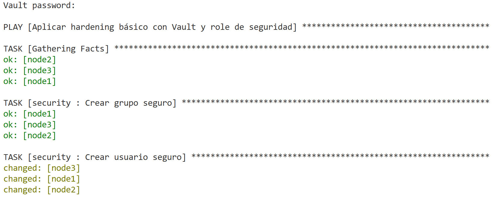

22. Es posible que los nodos se detengan al ejecutar el comando anterior (Esto sucede porque estamos en contenedores y al reiniciar el servicio detiene los contenedores).

> Nota: Ejecutar este comando en una nueva terminal:

```bash
docker start node1 node2 node2
```

> Nota: Al terminar el comando anterior regresa al **ansible-control**

23. Validar usuario creado:

```bash
ANSIBLE_CONFIG=/ansible/ansible.cfg ansible all -m shell -a "id devops
" --become
```
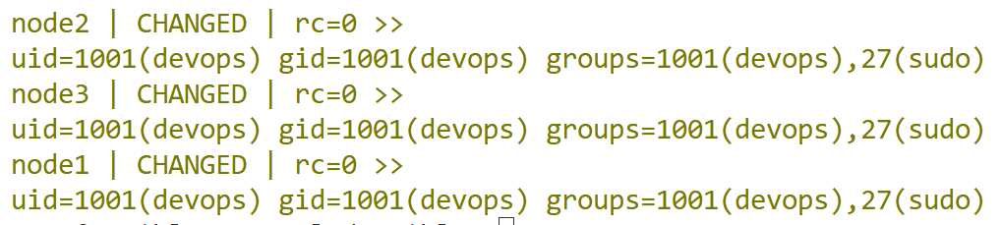

24. Validar archivo seguro:

```bash
ANSIBLE_CONFIG=/ansible/ansible.cfg  ansible all -m shell -a "ls -l /opt/security/security.conf" --become
```

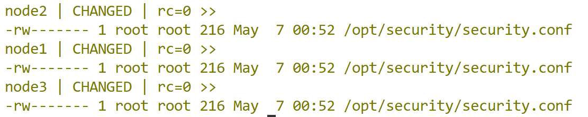


25. Validar configuración SSH

```bash
ANSIBLE_CONFIG=/ansible/ansible.cfg ansible all -m shell -a "grep '^PermitRootLogin' /etc/ssh/sshd_config" --become
```

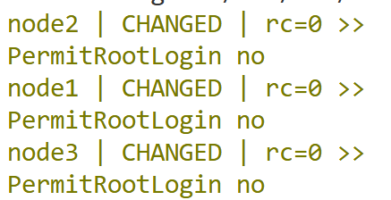


26. Validar usuarios permitidos

```bash
ANSIBLE_CONFIG=/ansible/ansible.cfg ansible all -m shell -a "grep '^AllowUsers' /etc/ssh/sshd_config" --become
```

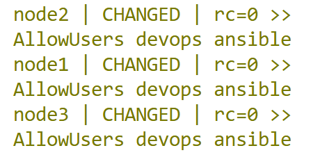


27. Crear playbook de validación automática:

```bash
nano playbooks/validate-hardening.yml
```

```yml
- name: Validar configuración de hardening
  hosts: all
  become: true

  tasks:
    - name: Validar que el usuario seguro existe
      shell: "id devops"
      register: user_check
      changed_when: false

    - name: Confirmar existencia del usuario
      assert:
        that:
          - user_check.rc == 0
        success_msg: "Usuario devops existe correctamente"
        fail_msg: "El usuario devops no existe"

    - name: Validar existencia del archivo de seguridad
      stat:
        path: /opt/security/security.conf
      register: security_file

    - name: Confirmar archivo con permisos seguros
      assert:
        that:
          - security_file.stat.exists
          - security_file.stat.mode == "0600"
        success_msg: "security.conf existe y tiene permisos 0600"
        fail_msg: "security.conf no existe o tiene permisos incorrectos"

    - name: Validar configuración PermitRootLogin
      shell: "grep '^PermitRootLogin no' /etc/ssh/sshd_config"
      register: root_login_check
      changed_when: false

    - name: Confirmar root login deshabilitado
      assert:
        that:
          - root_login_check.rc == 0
        success_msg: "PermitRootLogin está deshabilitado"
        fail_msg: "PermitRootLogin no está correctamente configurado"

    - name: Validar puerto SSH configurado
      shell: "grep '^Port 22' /etc/ssh/sshd_config"
      register: ssh_port_check
      changed_when: false

    - name: Confirmar puerto SSH
      assert:
        that:
          - ssh_port_check.rc == 0
        success_msg: "Puerto SSH configurado correctamente"
        fail_msg: "Puerto SSH incorrecto"

    - name: Validar usuarios permitidos por SSH
      shell: "grep '^AllowUsers devops ansible' /etc/ssh/sshd_config"
      register: allow_users_check
      changed_when: false

    - name: Confirmar AllowUsers
      assert:
        that:
          - allow_users_check.rc == 0
        success_msg: "AllowUsers configurado correctamente"
        fail_msg: "AllowUsers no está correctamente configurado"
```

28. Ejecutar validación automatica: 

```bash
ANSIBLE_CONFIG=/ansible/ansible.cfg ansible-playbook playbooks/validate-hardening.yml
```


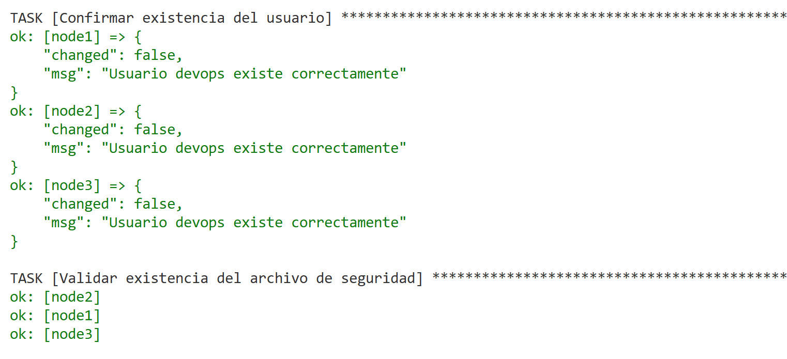


## Resultado esperado [Instrucciones](#instrucciones)

Al final el alumno debería de observar la ejecución de las pruebas de seguridad usando ansible


