# 4. Despliegue controlado con tags y manejo de fallos

Al finalizar la actividad, serás capaz de ejecutar un despliegue controlado sobre múltiples nodos Docker usando Ansible, aplicando tags, estrategia serial, manejo de errores con block/rescue/always y validaciones posteriores al despliegue.


## Objetivos
- Realizar un despliegue de app usando nginx y templates
- Aplicamos el despliegue controlado usando tags
- Usamos el manejo de errores


---

<div style="width: 400px;">
        <table width="50%">
            <tr>
                <td style="text-align: center;">
                    <a href="../Capitulo3/"></a>
                    <br>anterior
                </td>
                <td style="text-align: center;">
                   <a href="../README.md">Lista Laboratorios</a>
                </td>
<td style="text-align: center;">
                    <a href="../Capitulo5/"></a>
                    <br>siguiente
                </td>
            </tr>
        </table>
</div>

---

## Diagrama

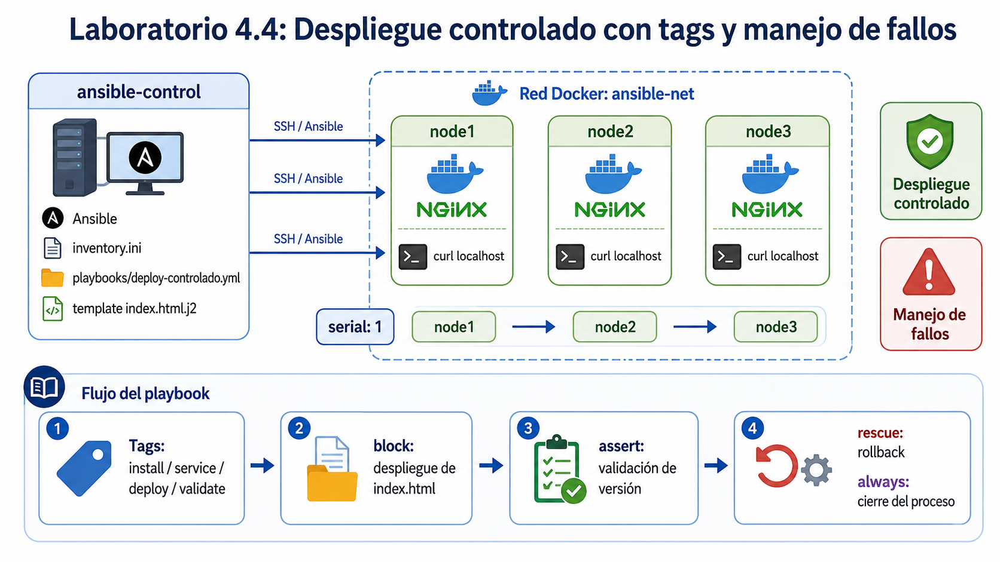

## Instrucciones

1. Para este laboratorio necesitamos descargar el contenido de la carpeta configuración donde tenemos el siguiente contenido: 

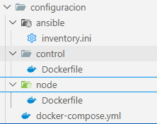

2. Abrir una terminal dentro de la carpeta **configuración** y ejecutar el siguiente comando:

```bash
docker-compose up -d
```

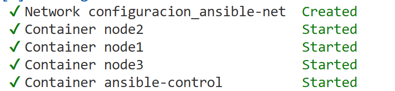

3. Conectarse a **ansible control**

```bash
docker exec -it ansible-control bash
```

4. Instalamos nano en **ansible-control**

```bash
apt-get update
```

```bash
apt-get install nano
```


5. Validamos conectividad: 

```bash
ansible all -i inventory.ini -m ping
```

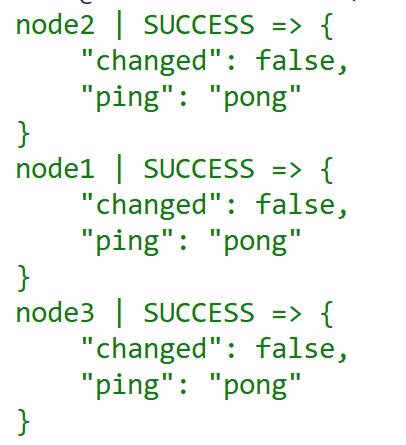

6. Revisamos inventario:

```bash
cat inventory.ini
```

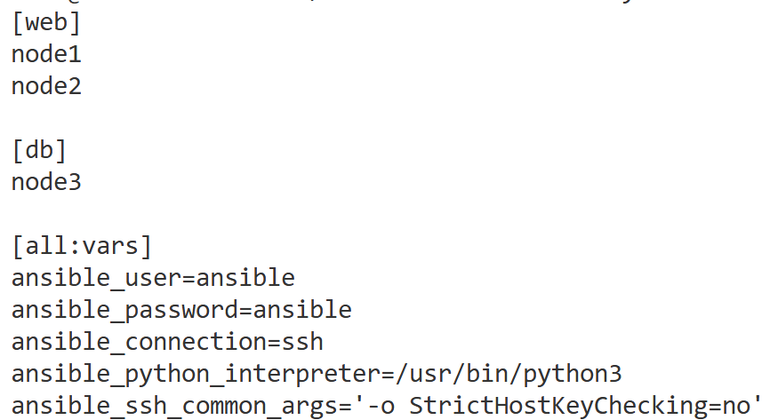

7. Para este laboratorio necesitamos que **nodo3** este en el grupo **web**, editaremos el archivo **inventory.ini**:

```bash
nano inventory.ini
```

```bash
[web]
node1
node2
node3

[all:vars]
ansible_user=ansible
ansible_password=ansible
ansible_connection=ssh
ansible_python_interpreter=/usr/bin/python3
ansible_ssh_common_args='-o StrictHostKeyChecking=no'
```

8. Validamos con el siguiente comando:

```bash
ansible -i inventory.ini  web -m ping
```

9. Creamos la estructura para los templates:

```bash
mkdir -p playbooks/templates
```

10. Creamos un template para nuestra página web:

```bash
nano playbooks/templates/index.html.j2
```

**index.html.j2**
```html
<html>
<head>
  <title>Despliegue controlado con Ansible</title>
</head>
<body style="font-family: Arial;">
  <h1>Aplicación desplegada con Ansible</h1>
  <p><strong>Servidor:</strong> {{ inventory_hostname }}</p>
  <p><strong>Versión:</strong> {{ app_version }}</p>
  <p><strong>Estado:</strong> Despliegue exitoso</p>
</body>
</html>
```

11. **Crear playbook para despliegue controlado**:

```bash
nano playbooks/deploy-controlado.yml
```

**deploy-controlado.yml**
```yml
---
- name: Despliegue controlado con tags y manejo de fallos
  hosts: web
  become: true
  serial: 1

  vars:
    app_version: "v1.0"

  tasks:
    - name: Instalar NGINX
      apt:
        name: nginx
        state: present
        update_cache: true
      tags:
        - install

    - name: Iniciar servicio NGINX
      shell: service nginx start
      tags:
        - service

    - name: Despliegue de aplicación con manejo de errores
      block:
        - name: Crear página web desde template
          template:
            src: templates/index.html.j2
            dest: /var/www/html/index.html
            mode: '0644'
          tags:
            - deploy

        - name: Validar respuesta HTTP local
          shell: curl -s http://localhost
          register: web_result
          changed_when: false
          tags:
            - validate

        - name: Confirmar que la página contiene la versión esperada
          assert:
            that:
              - "'{{ app_version }}' in web_result.stdout"
            success_msg: "La versión {{ app_version }} fue desplegada correctamente"
            fail_msg: "La versión {{ app_version }} no fue encontrada en la página"
          tags:
            - validate

      rescue:
        - name: Registrar fallo del despliegue
          debug:
            msg: "El despliegue falló en {{ inventory_hostname }}. Ejecutando acción de recuperación."
          tags:
            - rescue

        - name: Crear página de rollback básica
          copy:
            dest: /var/www/html/index.html
            content: |
              <html>
              <body>
                <h1>Rollback ejecutado</h1>
                <p>Servidor: {{ inventory_hostname }}</p>
                <p>Se detectó un error durante el despliegue.</p>
              </body>
              </html>
          tags:
            - rescue

      always:
        - name: Mostrar cierre de ejecución
          debug:
            msg: "Finalizó el proceso de despliegue en {{ inventory_hostname }}"
          tags:
            - always
```

12. Ejecutar el despliegue completo

```bash 
ansible-playbook -i inventory.ini playbooks/deploy-controlado.yml
```

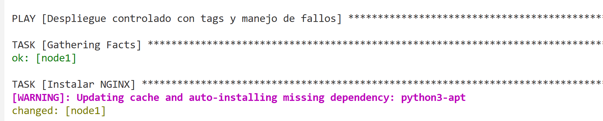

> Nota: Al ejecutar  el despliegue controlado notarás que realiza el despliegue por servidor 1 por 1 

13. Validar el resultado:

```bash
ansible -i inventory.ini web -m uri -a "url=http://localhost return_co
ntent=true"
```

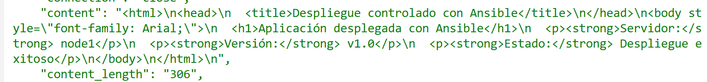


14. Ejecutar solo instalación usando tags:

```bash
ansible-playbook -i inventory.ini playbooks/deploy-controlado.yml --tags install
```
>Nota: La ejecución de la instalación también es en serie

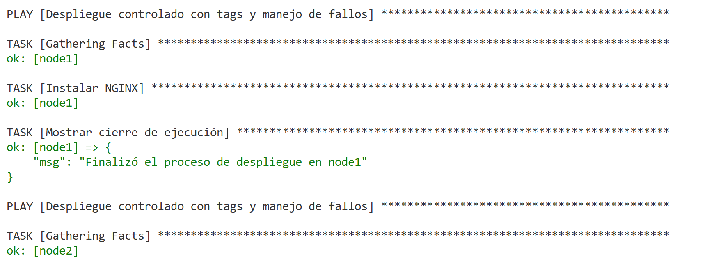


15. Ejecutar sólo validación

```bash
ansible-playbook -i inventory.ini playbooks/deploy-controlado.yml --tags validate
```
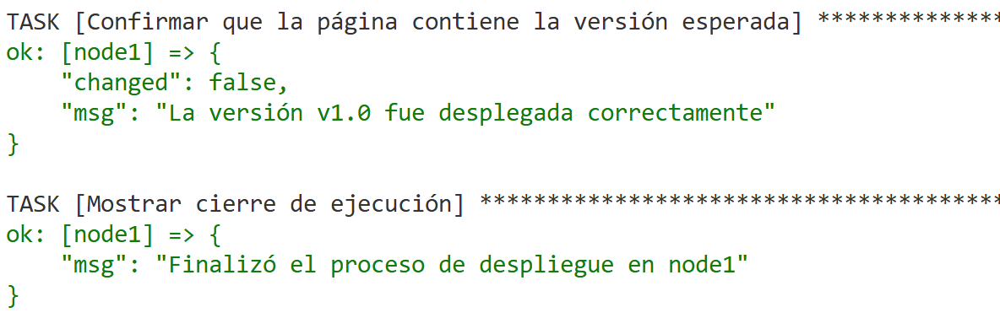

16. **Simular un fallo controlado**, ahora debemos de modificar el playbook para provocar un error y observar el **rescue**:

```bash
nano playbooks/deploy-controlado.yml
```

**busca esta parte:**
```bash
app_version: "v1.0"
```

**Cámbiala por:**

```bash
app_version: "v2.0"
```

17. Edita el template, deja la versión v1.0 para forzar que el assert falle.

```bash
nano playbooks/templates/index.html.j2
```

**Cambia la siguiente línea**

```html
<p><strong>Versión:</strong> {{ app_version }}</p>
```

**Por la siguiente:**

```html
<p><strong>Versión:</strong> v1.0</p>
```

18. Ejecuta nuevamente:

```bash
ansible-playbook -i inventory.ini playbooks/deploy-controlado.yml
```

>Nota:  Ahora el playbook intentará validar v2.0, pero la página tendrá v1.0, por lo que se ejecutará el bloque rescue.

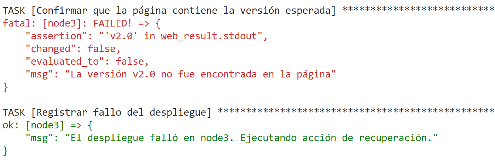

19. Validar rollback

```bash
ansible -i inventory.ini web -m uri -a "url=http://localhost return_content=true"
```

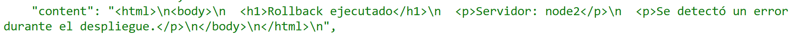


## Resultado Esperado 

Al final se espera que el alumno pueda desplegar y validar que el rollback se ejecute en caso de algúnb fallo. 

