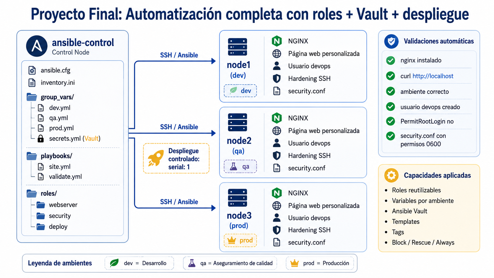

# 5. Proyecto Final: Automatización completa con roles + Vault + despliegue

## Objetivos
Al finalizar la actividad, serás capaz de construir una automatización end-to-end con Ansible para aprovisionar, configurar, proteger, desplegar y validar un servicio web en múltiples ambientes usando roles, variables, templates, Vault, tags y despliegue controlado.

---
<div style="width: 400px;">
        <table width="50%">
            <tr>
                <td style="text-align: center;">
                    <a href="../Capitulo4/"></a>
                    <br>anterior
                </td>
                <td style="text-align: center;">
                   <a href="../README.md">Lista Laboratorios</a>
                </td>
<td style="text-align: center;">
                    <a href="../Capitulo6/"></a>
                    <br>siguiente
                </td>
            </tr>
        </table>
</div>

---

## Diagrama




## Escenario del proyecto
La empresa NovaBank Solutions cuenta con una pequeña plataforma web interna utilizada por los equipos de tecnología para publicar información operativa de cada ambiente. Actualmente, la configuración de los servidores se realiza de forma manual, lo que ha provocado diferencias entre ambientes, errores de configuración y falta de evidencia técnica para auditoría.

El equipo de Infraestructura y DevOps ha decidido implementar una solución de automatización con Ansible para estandarizar el aprovisionamiento, configuración, seguridad y validación de los servidores.


La empresa cuenta con tres ambientes:

- **node1->Desarrollo (dev)**
- **node2->Calidad (qa)**
- **node3->Producción (prod)**

Todos los servidores están simulados mediante contenedores Docker y serán administrados desde un nodo de control llamado:

- **ansible-control**

El objetivo del proyecto es construir una automatización completa que pueda ejecutarse de forma repetible, segura y controlada.


## Proyecto final curso Ansible
### Automatización end-to-end de una plataforma web multiambiente con Ansible

### Objetivo del Proyecto

Diseñar e implementar una solución de automatización con Ansible que permita aprovisionar, configurar, proteger, desplegar y validar una aplicación web en tres ambientes diferentes: dev, qa y prod.


### La solución debe utilizar:
- Inventarios por ambiente
- Variables por grupo
- Roles reutilizables
- Templates Jinja2
- Ansible Vault
- Tags
- Despliegue controlado con serial
- Manejo de errores con block, rescue y always
- Validaciones automáticas

### Requerimientos funcionales

1. Inventario

```yml
[dev]
node1

[qa]
node2

[prod]
node3

[web]
node1
node2
node3
```

2. Variables por ambiente: Cada ambiente debe tener su propio archivo de variables. 

```bash
group_vars/dev.yml
group_vars/qa.yml
group_vars/prod.yml
```

**cada archivo debe definir al menos**

**Ejemplo:**
```yml
app_env: "prod"
app_version: "v1.0-prod"
app_message: "Ambiente de Producción"
web_color: "lightyellow"
```

3. Gestión de secretos con Vault: El proyecto debe de incluir cifrado con Ansible Vault.

```bash
group_vars/secrets.yml
```

Debe contener al menos:

```yml
admin_email: "admin@empresa.com"
api_token: "token-demo"
secure_user: "devops"
```

4. Role **webserver**: El alumno debe de encargarse de crear un role que debe de hacer lo siguiente:

-Actualizar caché de paquetes
- Instalar NGINX
- Iniciar NGINX
- Permitir ejecución mediante tag install y service


5. Role **security**: El alumno debe de crear este rol que tendra las siguientes responsabilidades:

- Crear un usuario seguro definido en Vault
- Crear el directorio /opt/security
- Crear el archivo /opt/security/security.conf
- Configurar PermitRootLogin no
- Ajustar permisos seguros del archivo SSH
- Usar handler para reiniciar SSH

El archivo **security.conf** debe incluir información como:

```bash
usuario_seguro
correo_admin
ambiente
servidor
```

**debe de tener permisos**
```bash
0600
```

6. Role **deploy**: El alumno deberá de crear este rol que tendrá las siguientes responsabilidades:

- Generar una página index.html usando Jinja2
- Mostrar información del nodo
- Mostrar ambiente
- Mostrar versión
- Mostrar correo del administrador
- Validar que la página fue desplegada correctamente
- Aplicar manejo de errores con block, rescue y always

**Template que se debe usar**

```html
<html>
<head>
  <title>Proyecto Final Ansible - {{ app_env }}</title>
</head>
<body style="font-family: Arial; background-color: {{ web_color }};">
  <h1>Aplicación desplegada con Ansible</h1>

  <h2>Información del despliegue</h2>
  <ul>
    <li><strong>Servidor:</strong> {{ inventory_hostname }}</li>
    <li><strong>Ambiente:</strong> {{ app_env }}</li>
    <li><strong>Mensaje:</strong> {{ app_message }}</li>
    <li><strong>Versión:</strong> {{ app_version }}</li>
    <li><strong>Administrador:</strong> {{ admin_email }}</li>
  </ul>

  <p>Este archivo fue generado automáticamente con Ansible, roles, variables y Vault.</p>
</body>
</html>
```

## Requerimientos de despliegue

1. **Playbook principal**: El proyecto debe tener un playbook principal

```bash
playbooks/site.yml
```

**Debe de aplicar los siguientes roles**

```yml
roles:
  - webserver
  - security
  - deploy
```


2. **Despliegue controlado**: El playbook debe ejecutarse nodo por nodo usando:

```bash
serial: 1
```


## Evidencias de se deben entregar

Enviar un correo electrónico a **correo instructor** con los siguientes datos:

- Asunto: Curso Ansible **fecha**
- Nombre: **Nombre alumno completo**
- Capturas de pantalla de los siguientes comandos:

```bash
ansible-playbook playbooks/site.yml --ask-vault-pass
```

```bash
ansible-playbook playbooks/validate.yml
```

```bash
ansible web -m shell -a "curl -s http://localhost" --become
```

```bash
ansible web -m shell -a "ls -l /opt/security/security.conf" --become
```


```bash
ansible web -m shell -a "grep '^PermitRootLogin' /etc/ssh/sshd_config" --become
```


## Resultado Esperado [Instrucciones](#instrucciones)

Al final se espera que el alumno envíe el correo electrónico con todas las evidencias solicitadas


